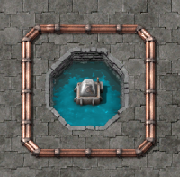

# Floating Lamps

A mod for Factorio that adds floating lamps

## Items Added By This Mod

* Floating Lamp

## Mod Integrations

* [https://mods.factorio.com/mod/cargo-ships](Cargo Ships) - Makes Floating Electric Poles provide electricity around them like a substation

## Acknowledgments

* [ZwerOxotnik](https://mods.factorio.com/user/ZwerOxotnik) - Select files borrowed from ZwerOxotnik's excellent [factorio-example-mod](https://github.com/ZwerOxotnik/factorio-example-mod)
